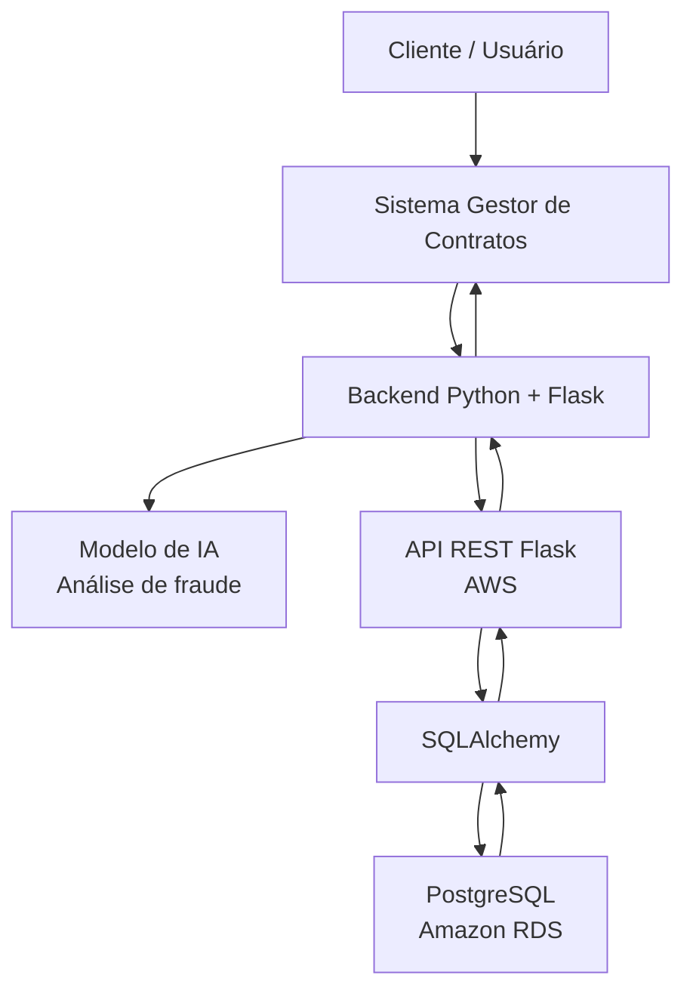

# Gestor de Contratos

## Nome do projeto

**Gestor de Contratos**

---

## Descrição

O **Gestor de Contratos** é um sistema desenvolvido para centralizar o cadastro, a consulta, a atualização e o acompanhamento de contratos e das informações relacionadas a eles.

A solução possui uma interface web e um backend desenvolvidos em **Python com Flask**. O backend do sistema se comunica com uma **API REST hospedada na AWS**, responsável por realizar as operações de persistência e consulta no banco de dados **PostgreSQL hospedado no Amazon RDS**.

Além do gerenciamento tradicional dos contratos, o backend do sistema possui um **modelo de Inteligência Artificial** responsável por analisar os contratos e indicar possíveis sinais de fraude.

A solução, portanto, integra gerenciamento contratual, serviços em nuvem, banco de dados e Inteligência Artificial em uma única arquitetura.

---

## Problema escolhido

O gerenciamento de contratos envolve diversas informações importantes, como:

- clientes;
- usuários responsáveis;
- contratos;
- cláusulas;
- aditivos;
- valores;
- datas;
- alterações de status;
- histórico das operações.

Quando essas informações são armazenadas ou controladas de forma descentralizada, o acompanhamento dos contratos se torna mais difícil, aumentando o risco de inconsistências, perda de informações e dificuldade de consulta.

Além disso, contratos podem apresentar informações ou características suspeitas que exigem análise adicional. Uma avaliação totalmente manual pode consumir tempo e dificultar a identificação rápida de possíveis fraudes.

---

## Solução proposta

A solução proposta é um **sistema web de gestão de contratos** que reúne as funcionalidades de gerenciamento e análise dos contratos.

O usuário acessa o sistema por meio da interface web. As ações realizadas são processadas pelo backend desenvolvido em Flask.

Quando é necessário consultar ou alterar informações persistidas, o backend realiza requisições HTTP para a API REST hospedada na AWS. A API processa essas requisições e se comunica com o banco PostgreSQL hospedado no Amazon RDS.

O backend também possui um modelo de Inteligência Artificial responsável pela análise dos contratos para identificação de possíveis indícios de fraude.

### Fluxo simplificado

```text
Cliente / Usuário
       |
       v
Sistema Gestor de Contratos
Frontend + Backend Flask
       |
       |------------------------------|
       |                              |
       v                              v
Modelo de IA                    API REST Flask
Análise de fraude               Hospedada na AWS
                                      |
                                      | SQLAlchemy
                                      v
                                PostgreSQL
                                Amazon RDS
```

---

## Integrantes

| Nome | RM |
| --- | --- |
| Davi Oliveira da Silva | RM569108 |
| João Pedro Morangoni | RM570073 |
| João Vitor Xavier de Carvalho | RM570633 |

---

## Tecnologias utilizadas

- **Python** — linguagem principal do projeto;
- **Flask** — framework utilizado no backend do sistema e na construção da API REST;
- **Flask-SQLAlchemy** — integração do Flask com o SQLAlchemy;
- **SQLAlchemy** — ORM utilizado para comunicação com o banco de dados;
- **PostgreSQL** — banco de dados relacional;
- **Amazon RDS** — serviço da AWS utilizado para hospedar o PostgreSQL;
- **AWS Lambda** — ambiente de nuvem utilizado para disponibilizar a API;
- **psycopg2** — driver utilizado na conexão com PostgreSQL;
- **python-dotenv** — carregamento das variáveis de ambiente;
- **Werkzeug** — utilizado por funcionalidades do Flask, incluindo hash seguro de senhas;
- **Swagger / OpenAPI** — documentação e testes dos endpoints da API;
- **Modelo de Inteligência Artificial** — utilizado para análise de contratos e identificação de possíveis fraudes;
- **Git** — controle de versão;
- **GitHub** — hospedagem e versionamento do repositório.

---

# Arquitetura inicial

A arquitetura é dividida em quatro componentes principais:

### 1. Interface do sistema

É o ponto de acesso do usuário ao Gestor de Contratos. Por meio dela, o cliente pode executar as funcionalidades disponibilizadas pelo sistema.

### 2. Backend Flask

O backend recebe as ações realizadas no sistema e contém as regras de negócio da aplicação.

Ele possui duas responsabilidades principais:

- comunicar-se com a API hospedada na AWS;
- executar a análise de fraude utilizando o modelo de Inteligência Artificial.

### 3. API REST na AWS

A API REST funciona como intermediária entre o sistema e o banco de dados.

Ela recebe requisições HTTP, valida os dados, executa as operações necessárias e retorna respostas no formato JSON.

Os principais métodos utilizados são:

- `GET`;
- `POST`;
- `PUT`;
- `DELETE`.

### 4. PostgreSQL no Amazon RDS

O banco PostgreSQL é responsável pela persistência das informações do sistema.

A comunicação entre a API e o banco é realizada com **SQLAlchemy**.

### Diagrama da arquitetura



---

# Banco de dados utilizado

O projeto utiliza **PostgreSQL**, hospedado no **Amazon RDS**.

As principais tabelas são:

- `cliente`;
- `usuario`;
- `contrato`;
- `clausula`;
- `aditivo`;
- `historico_status`.

## Relacionamentos principais

- um cliente pode possuir vários contratos;
- um usuário pode estar associado a contratos;
- um contrato pode possuir várias cláusulas;
- um contrato pode possuir vários aditivos;
- um contrato pode possuir vários registros no histórico de status;
- alterações de status podem registrar o usuário responsável pela alteração.

---

# Modelo de Inteligência Artificial

O backend do Gestor de Contratos possui um modelo de Inteligência Artificial responsável por realizar a **análise de fraude dos contratos**.

O modelo faz parte da camada interna do sistema e é utilizado para auxiliar na identificação de contratos que possam apresentar características suspeitas.

O fluxo de análise é:

```text
Contrato
   |
   v
Backend Flask
   |
   v
Modelo de IA
   |
   v
Análise de possível fraude
   |
   v
Resultado apresentado/processado pelo sistema
```

> A descrição do algoritmo, das variáveis utilizadas e das métricas do modelo pode ser acrescentada nesta seção caso seja necessária na documentação final.

---

# Instruções de instalação

## 1. Clonar o repositório

```bash
git clone https://github.com/joaomorangoni/Gestao-de-contratos.git
cd Gestao-de-contratos
```

---

## 2. Criar o ambiente virtual

No Windows PowerShell:

```powershell
python -m venv venv
```

Ative o ambiente:

```powershell
.\venv\Scripts\Activate.ps1
```

Caso o PowerShell bloqueie a execução:

```powershell
Set-ExecutionPolicy -Scope Process -ExecutionPolicy Bypass
.\venv\Scripts\Activate.ps1
```

Quando o ambiente estiver ativo, o terminal deverá apresentar:

```text
(venv)
```

---

## 3. Instalar as dependências

```powershell
python -m pip install -r requirements.txt
```

---

# Configuração das variáveis de ambiente

As credenciais e informações de conexão não devem ficar diretamente no código-fonte.

Crie um arquivo chamado:

```text
.env
```

na raiz do projeto.

## Variáveis utilizadas pela API

Exemplo:

```env
DB_HOST=seu-endpoint-rds.amazonaws.com
DB_PORT=5432
DB_NAME=nome_do_banco
DB_USER=usuario_do_banco
DB_PASSWORD=senha_do_banco
```

## URL da API utilizada pelo sistema

O backend consumidor pode utilizar uma variável para armazenar a URL pública da API:

```env
API_BASE_URL=https://URL_PUBLICA_DA_API
```

> Substitua `URL_PUBLICA_DA_API` pela URL real da API hospedada na AWS.

## Segurança das credenciais

O arquivo `.env` **não deve ser enviado ao GitHub**.

O `.gitignore` deve conter:

```gitignore
.env
.env.*
!.env.example
```

É recomendado manter no repositório apenas um `.env.example`, sem credenciais reais.

---

# Instruções para execução

## Execução local

Com o ambiente virtual ativado e as dependências instaladas:

```powershell
python app.py
```

Durante o desenvolvimento, a aplicação/API pode ser acessada localmente em:

```text
http://127.0.0.1:5000
```

---

## Execução utilizando a API na AWS

Em produção, o backend do Gestor de Contratos utiliza a URL pública da API hospedada na AWS.

Exemplo:

```text
https://URL_PUBLICA_DA_API
```

Uma consulta de contratos, por exemplo, será realizada utilizando:

```text
GET https://URL_PUBLICA_DA_API/contratos
```

O fluxo é:

```text
Sistema
   |
   | Requisição HTTP
   v
API na AWS
   |
   | SQLAlchemy
   v
PostgreSQL no Amazon RDS
   |
   v
Resposta JSON
   |
   v
Sistema
```

---

# Principais endpoints

A API disponibiliza operações CRUD para as principais entidades do sistema.

## Clientes

| Método | Endpoint | Função |
| --- | --- | --- |
| GET | `/clientes` | Lista todos os clientes |
| GET | `/clientes/<id>` | Consulta um cliente |
| POST | `/clientes` | Cadastra um cliente |
| PUT | `/clientes/<id>` | Atualiza um cliente |
| DELETE | `/clientes/<id>` | Remove um cliente |

## Usuários

| Método | Endpoint | Função |
| --- | --- | --- |
| GET | `/usuarios` | Lista todos os usuários |
| GET | `/usuarios/<id>` | Consulta um usuário |
| POST | `/usuarios` | Cadastra um usuário |
| PUT | `/usuarios/<id>` | Atualiza um usuário |
| DELETE | `/usuarios/<id>` | Remove um usuário |

## Contratos

| Método | Endpoint | Função |
| --- | --- | --- |
| GET | `/contratos` | Lista todos os contratos |
| GET | `/contratos/<id>` | Consulta um contrato |
| POST | `/contratos` | Cadastra um contrato |
| PUT | `/contratos/<id>` | Atualiza um contrato |
| DELETE | `/contratos/<id>` | Remove um contrato |

## Cláusulas

| Método | Endpoint | Função |
| --- | --- | --- |
| GET | `/clausulas` | Lista todas as cláusulas |
| GET | `/clausulas/<id>` | Consulta uma cláusula |
| POST | `/clausulas` | Cadastra uma cláusula |
| PUT | `/clausulas/<id>` | Atualiza uma cláusula |
| DELETE | `/clausulas/<id>` | Remove uma cláusula |

## Aditivos

| Método | Endpoint | Função |
| --- | --- | --- |
| GET | `/aditivos` | Lista todos os aditivos |
| GET | `/aditivos/<id>` | Consulta um aditivo |
| POST | `/aditivos` | Cadastra um aditivo |
| PUT | `/aditivos/<id>` | Atualiza um aditivo |
| DELETE | `/aditivos/<id>` | Remove um aditivo |

## Histórico de status

| Método | Endpoint | Função |
| --- | --- | --- |
| GET | `/historico-status` | Lista o histórico de status |
| GET | `/historico-status/<id>` | Consulta um registro |
| POST | `/historico-status` | Cria um registro de histórico |
| PUT | `/historico-status/<id>` | Atualiza um registro |
| DELETE | `/historico-status/<id>` | Remove um registro |

---

# Exemplos de requisições

## Criar cliente

### `POST /clientes`

```json
{
  "nome": "Empresa ABC",
  "tipo": "PJ",
  "documento": "12345678000190",
  "email": "contato@empresa.com",
  "telefone": "11999999999"
}
```

---

## Criar contrato

### `POST /contratos`

```json
{
  "numero": "CTR-001",
  "titulo": "Contrato de prestação de serviços",
  "cliente_id": 1,
  "usuario_id": 1,
  "tipo_contrato": "SERVICO",
  "valor_total": 15000.00,
  "data_inicio": "2026-09-07",
  "data_fim": "2027-09-07",
  "status": "ATIVO"
}
```

---

# Documentação Swagger

A API possui documentação utilizando **Swagger/OpenAPI**.

## Desenvolvimento local

```text
http://127.0.0.1:5000/swagger/
```

## AWS

```text
https://URL_PUBLICA_DA_API/swagger/
```

O Swagger permite consultar e testar:

- endpoints disponíveis;
- métodos HTTP;
- parâmetros;
- corpo das requisições;
- exemplos de dados;
- códigos HTTP;
- respostas retornadas pela API.

> Antes da entrega final, substitua `URL_PUBLICA_DA_API` pelo endereço real da aplicação na AWS.

---

# Estrutura básica do projeto

Uma estrutura simplificada do projeto pode ser representada da seguinte forma:

```text
Gestao-de-contratos/
├── app.py
├── requirements.txt
├── README.md
├── .gitignore
├── .env
├── .env.example
├── modelo_ia/
└── arquivos_do_sistema/
```

> A estrutura acima deve ser ajustada caso os nomes das pastas e arquivos do repositório sejam diferentes.

---

# Link para documentação Swagger

### Desenvolvimento local

```text
http://127.0.0.1:5000/swagger/
```

### AWS

```text
https://URL_PUBLICA_DA_API/swagger/
```

---

# Link do Trello ou Notion

Trello utilizado pelo grupo para organização do projeto:

https://trello.com/invite/b/6a982f1afac57a4b37efe2db/ATTI93e793cb437404ce67b3bed5de1bf146603D5766/gestor-de-contratos

---

# Resumo da arquitetura

```text
Usuário
  |
  v
Gestor de Contratos
Frontend + Backend Flask
  |
  |-------------------------------|
  |                               |
  v                               v
Modelo de IA                 API REST na AWS
Análise de fraude                  |
                                   v
                              Amazon RDS
                              PostgreSQL
```
